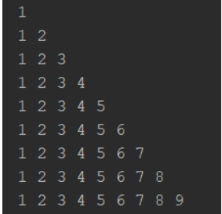

## Es 1
Creare un metodo che prenda come argomento un numero intero e stampi a video i 10 numeri successivi (fai l’esercizio sia con ciclo for che con while).

## Es 2
Creare un metodo che prenda come argomento un numero intero e stampi a video i 10 numeri precedenti (fai l’esercizio sia con ciclo for che con while).

## Es 3
Crea un metodo che prenda come argomento un numero intero e restituisca un array di 10 elementi che contiene i 10 numeri successivi al numero passato (fai l’esercizio sia con ciclo for che con while).

## Es 4
Crea un metodo che prenda come argomento un numero intero e stampi a video la tabellina del numero inserito.

## Es 5 
Crea un metodo che prenda come argomento due numeri e stampi a video il numero più piccolo.

## Es 6
Crea un metodo che prenda come argomento due stringhe e restituisca true se le stringhe sono uguali. Se non sono uguali ovviamente deve restituire false.

## Es 7
Crea un metodo che prenda come argomento un array di numeri interi e restituisca un array che contiene gli stessi numeri dispari e al posto dei numeri pari il valore 0.

## Es 8
Crea un metodo che prenda come argomento un array di interi ed un numero e restituisca true se il numero è presente nell’array, altrimenti false.

## Es 9
Implementare un metodo di nome filtra che prende come parametro un array ‘a’ di numeri interi e un intero positivo ‘k’, e che restituisce un nuovo array ‘b’ di numeri interi contenente i soli elementi di ‘a’ che sono divisibili per ‘k’. Si faccia in modo che l’array ‘b’ abbia una dimensione uguale al numero di elementi che deve contenere (non devono cioè esservi posizioni inutilizzate). 

## Es 10
Crea un metodo che prenda come argomento un numero intero e restituisca un array di caratteri che rappresenta il numero inserito in formato binario (ad esempio se viene passato il numero 2 dovrà restituire l’array che contiene “10”).

## Es 11
Crea un metodo che stampi a video la seguente immagine

